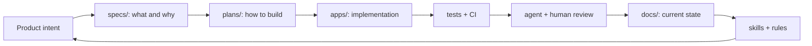

# Software Factory Starter

A sample repository for building AI-assisted software teams with repeatable engineering loops.

This repo is intentionally small. It contains dummy apps, agent instructions, docs, specs, plans, review loops, MCP policy examples, and CI scaffolding that show how to move from vibe coding to vibe engineering.

## What This Demonstrates

- `AGENTS.md` as the operating contract for humans and agents.
- `DESIGN.md` as a durable design contract.
- `specs/`, `plans/`, and `docs/` as separate artifacts.
- Spec-driven development where agents research and plan before code.
- Agent skills for repeatable workflows.
- MCP/tool boundaries with explicit trust and permission rules.
- Agentic code review as a self-enforcing loop.
- TDD, CI, and validation gates.
- Containers/runtime-image thinking without requiring real infrastructure.
- Factory metrics that prove whether the system is improving.
- Subagent workflows for parallel exploration, implementation, and review.
- Repository governance with CODEOWNERS, branch protection expectations, and PR gates.

## Repository Layout

```text
.
├── AGENTS.md
├── DESIGN.md
├── .agents/skills/
├── .cursor/rules/
├── apps/
│   ├── service/
│   └── web/
├── docs/
├── specs/
├── plans/
├── mcp/
└── .github/workflows/
```

## Quick Start

```bash
make test
make lint
make validate-factory
```

The sample backend uses only the Python standard library so the starter can run without dependency setup.

## Factory Surfaces

| Surface | Purpose |
| --- | --- |
| `AGENTS.md` | Operating contract for agents and contributors |
| `DESIGN.md` | UI and product taste contract |
| `.agents/skills/` | Reusable agent workflows |
| `.cursor/rules/` | Cursor-compatible rule examples |
| `specs/` | Intended product behavior |
| `plans/` | Implementation strategy before code |
| `docs/` | Current architecture and operating knowledge |
| `mcp/` | Placeholder tool integration boundary |
| `scripts/validate_factory.py` | Lightweight repository structure check |

## Factory Loop



## Intended Use

Use this repository as a template. Replace the dummy app with your real product, but keep the factory surfaces:

1. Write the spec.
2. Ask the agent to research and write the plan.
3. Implement against the plan.
4. Run tests and CI.
5. Ask a review agent to inspect the diff.
6. Promote recurring lessons into docs, skills, rules, or tests.

## Sample Scenarios

The sample artifacts show three common factory workflows:

| Scenario | Spec | Plan | Skill |
| --- | --- | --- | --- |
| Build from a product artifact | `specs/use-cases/use-case-001-example.md` | `plans/PLAN_EXAMPLE_FEATURE.md` | `.agents/skills/spec-to-plan/SKILL.md` |
| Enforce review feedback loops | `specs/use-cases/use-case-002-agentic-review-loop.md` | `plans/PLAN_AGENTIC_REVIEW_LOOP.md` | `.agents/skills/agentic-code-review/SKILL.md` |
| Govern MCP/tool access | `specs/use-cases/use-case-003-mcp-tool-approval.md` | `plans/PLAN_MCP_TOOL_APPROVAL.md` | `.agents/skills/mcp-tool-policy-review/SKILL.md` |

## Useful Docs

- [Software factory principles](docs/SOFTWARE_FACTORY.md)
- [Operating model](docs/OPERATING_MODEL.md)
- [Docs, specs, and plans contract](docs/DOCS_SPECS_PLANS_CONTRACT.md)
- [Factory metrics](docs/FACTORY_METRICS.md)
- [Model runtime strategy](docs/MODEL_RUNTIME.md)
- [TDD and validation](docs/TDD_AND_VALIDATION.md)
- [Subagent workflow](docs/SUBAGENT_WORKFLOW.md)
- [Container runtime examples](docs/CONTAINERS_AND_RUNTIME_IMAGES.md)
- [Security and permissions](docs/SECURITY_AND_PERMISSIONS.md)
- [Repository governance](docs/REPOSITORY_GOVERNANCE.md)
