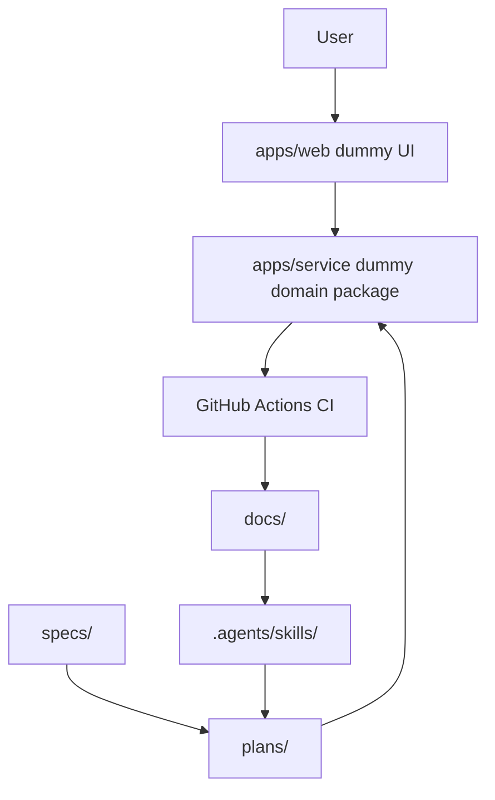

# Architecture

```mermaid
flowchart TB
    User["User"]
    Web["apps/web dummy UI"]
    Service["apps/service dummy domain package"]
    Specs["specs/"]
    Plans["plans/"]
    Docs["docs/"]
    Skills[".agents/skills/"]
    CI["GitHub Actions CI"]

    User --> Web
    Web --> Service
    Specs --> Plans
    Plans --> Service
    Service --> CI
    CI --> Docs
    Docs --> Skills
    Skills --> Plans
```

This is not a production architecture. It is a starter map showing where factory artifacts live.

