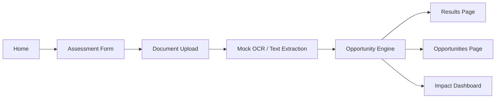

# Architecture

## Summary

Bayanihan Bridge PH is a client-side Vite React app. The MVP is intentionally local-first: profile state is stored in browser localStorage, opportunities come from JSON files, OCR is simulated when needed, and AI recommendations are deterministic TypeScript logic.

## Runtime Surfaces

- `src/main.tsx`: React entry point.
- `src/App.tsx`: route layout and page registration.
- `src/pages/`: six MVP pages.
- `src/components/`: reusable UI components.
- `src/data/`: sample jobs, courses, support programs, and mock assessed users.
- `src/lib/ocr.ts`: Computer Vision/OCR fallback.
- `src/lib/opportunityEngine.ts`: Data Science scoring and mock AI recommendations.
- `src/lib/storage.ts`: demo state persistence.

## Data Flow

## Opportunity Engine

The engine receives a user profile and extracted document text. It detects skills, ranks jobs, calculates missing skills, selects courses and support programs, creates a score breakdown, and returns a complete recommendation packet.

Score weights:

- Education readiness: 20
- Skills readiness: 25
- Internet/device access: 20
- Employment readiness: 10
- Social barrier readiness: 15
- Document readiness: 10

## OCR Strategy

The MVP does not require paid OCR. Text files are read directly. Images, PDFs, certificates, report cards, resumes, and handwritten forms produce deterministic mock OCR text with a confidence score and extracted highlights. This keeps the Computer Vision flow demo-ready without external setup.

## Dashboard Strategy

Dashboard charts combine local mock user analytics with the current assessment result when available. This gives judges a fuller impact view while keeping the app offline-capable.

## Future Integration Points

- Replace mock OCR with Tesseract.js or a server-side OCR pipeline.
- Add optional AI API recommendations behind a secure backend.
- Connect verified local government, school, NGO, or employer opportunity feeds.
- Add multilingual support for Filipino and regional languages.
