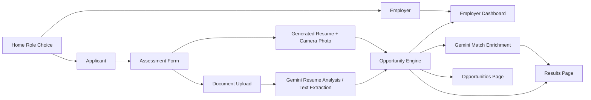

# Architecture

## Summary

OportuniPH is a Vite React app with a small local development proxy for Gemini resume analysis and recommendation enrichment. Profile state is stored in browser localStorage, opportunities come from JSON files, resumes can be uploaded or generated from profile plus camera capture, and recommendations use Gemini when configured with a deterministic TypeScript fallback.

## Runtime Surfaces

- `src/main.tsx`: React entry point.
- `src/App.tsx`: route layout and page registration.
- `src/pages/`: MVP pages, including the Home role chooser, applicant profile flow, analysis, results, market, and employer dashboard.
- `src/components/`: reusable UI components.
- `src/components/ResumeGenerator.tsx`: profile-based resume preset with camera capture and face-alignment guide.
- `src/data/`: sample jobs, courses, support programs, and mock assessed users.
- `src/lib/ocr.ts`: Gemini resume analysis client and local text-file fallback.
- `src/lib/geminiRecommendations.ts`: Gemini-backed ranking and reasoning merge for jobs, courses, and support programs.
- `vite.config.ts`: local Gemini proxy endpoints for resume analysis and recommendation enrichment.
- `src/lib/opportunityEngine.ts`: Data Science scoring and deterministic recommendation fallback.
- `src/lib/storage.ts`: demo state persistence.

## Data Flow

## Opportunity Engine

The engine receives a user profile and extracted resume text. It detects skills, ranks jobs, calculates missing skills, selects courses and support programs, creates a score breakdown, and returns a complete recommendation packet. When Gemini is configured, the app asks Gemini to re-rank only the provided local JSON opportunities and add concise fit reasoning and source labels.

Score weights:

- Education readiness: 20
- Skills readiness: 25
- Internet/device access: 20
- Employment readiness: 10
- Social barrier readiness: 15
- Document readiness: 10

## Document Analysis Strategy

When `GEMINI_API_KEY` is configured, uploaded resumes are sent through the local Vite proxy to the configured Gemini model for structured PDF, image, or text analysis. The prompt instructs Gemini to extract only visible information and lower confidence when content is blurry or missing.

If no Gemini key is configured, text-like files are read directly. Binary files are not fabricated; the app shows a clear configuration-required state.

## Generated Resume Strategy

The Analyze page also offers a generated-resume path for users who do not have a finished resume. It uses the saved profile, a beginner-role preset, optional contact fields, training and experience prompts, and a camera-captured applicant photo. Browser face detection is attempted with `FaceDetector`; if unavailable, the app uses local frame checks for lighting, sharpness, centered subject mass, and steadiness. The oval remains a framing guide, while a readiness checklist and score decide when capture is enabled.

## Employer Dashboard Strategy

The employer dashboard lets demo employers create local job offers without authentication or a backend. Offers are stored in localStorage and surfaced in the Market page so judges can see a simple two-sided marketplace loop.

## Future Integration Points

- Move Gemini proxy into a production backend before deployment.
- Add optional AI API recommendations behind a secure backend.
- Connect verified local government, school, NGO, or employer opportunity feeds.
- Add multilingual support for Filipino and regional languages.
