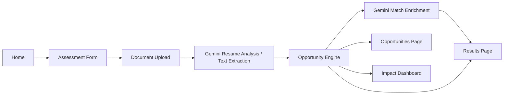

# Architecture

## Summary

Bayanihan Bridge PH is a Vite React app with a small local development proxy for Gemini resume analysis and recommendation enrichment. Profile state is stored in browser localStorage, opportunities come from JSON files, and recommendations use Gemini when configured with a deterministic TypeScript fallback.

## Runtime Surfaces

- `src/main.tsx`: React entry point.
- `src/App.tsx`: route layout and page registration.
- `src/pages/`: six MVP pages.
- `src/components/`: reusable UI components.
- `src/data/`: sample jobs, courses, support programs, and mock assessed users.
- `src/lib/ocr.ts`: Gemini resume analysis client and local text-file fallback.
- `src/lib/geminiRecommendations.ts`: Gemini-backed ranking and reasoning merge for jobs, courses, and support programs.
- `vite.config.ts`: local Gemini proxy endpoints for resume analysis and recommendation enrichment.
- `src/lib/opportunityEngine.ts`: Data Science scoring and deterministic recommendation fallback.
- `src/lib/storage.ts`: demo state persistence.

## Data Flow

## Opportunity Engine

The engine receives a user profile and extracted resume text. It detects skills, ranks jobs, calculates missing skills, selects courses and support programs, creates a score breakdown, and returns a complete recommendation packet. When Gemini is configured, the app asks Gemini to re-rank only the provided local JSON opportunities and add concise fit reasoning and source labels.

Score weights:

- Education readiness: 20
- Skills readiness: 25
- Internet/device access: 20
- Employment readiness: 10
- Social barrier readiness: 15
- Document readiness: 10

## Document Analysis Strategy

When `GEMINI_API_KEY` is configured, uploaded resumes are sent through the local Vite proxy to the configured Gemini model for structured PDF, image, or text analysis. The prompt instructs Gemini to extract only visible information and lower confidence when content is blurry or missing.

If no Gemini key is configured, text-like files are read directly. Binary files are not fabricated; the app shows a clear configuration-required state.

## Dashboard Strategy

Dashboard charts combine local mock user analytics with the current assessment result when available. This gives judges a fuller market view while keeping the app demo-capable.

## Future Integration Points

- Move Gemini proxy into a production backend before deployment.
- Add optional AI API recommendations behind a secure backend.
- Connect verified local government, school, NGO, or employer opportunity feeds.
- Add multilingual support for Filipino and regional languages.
