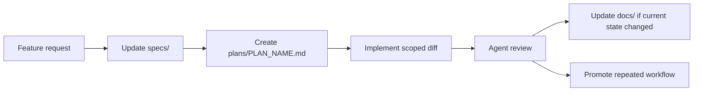

# Docs, Specs, And Plans Contract

This repository separates intent, strategy, and current-state knowledge so agents can reason without guessing.

## Artifact Boundaries

| Artifact | Question Answered | Examples |
| --- | --- | --- |
| `specs/` | What should exist and why? | use cases, acceptance criteria, non-goals |
| `plans/` | How will this change be implemented? | file-level approach, API shapes, rollout, tests |
| `docs/` | How does the system currently work? | architecture, operations, governance, security |
| `.agents/skills/` | How should repeated agent work be performed? | planning, review, TDD, MCP policy |

## Update Rules

- Change user-facing behavior: update `specs/`.
- Change implementation architecture or workflow: update `docs/`.
- Change the execution strategy for active work: update `plans/`.
- Repeat the same agent workflow twice: create or update a skill.
- Find a recurring review issue: add a test, checklist item, rule, or skill.

## Anti-Patterns

- Hiding product decisions in implementation comments only.
- Treating prompts as the only place where permissions are enforced.
- Letting plans become stale without reconciling them after implementation.
- Writing docs that describe a desired future state as if it already exists.
- Adding examples that require private credentials or hidden setup to copy.

## Example Change Flow

