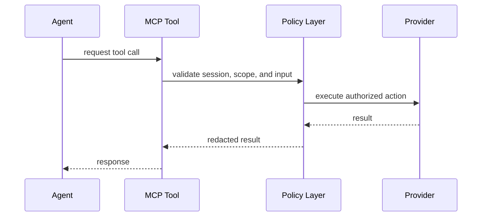

# MCP Trust Boundary

MCP servers and tools should be treated as privileged integration surfaces.

## Rules

- Do not put secrets in prompts.
- Do not give raw provider tools to every agent by default.
- Prefer backend-issued short-lived credentials.
- Use allowlists for tool names, scopes, and sessions.
- Log tool execution without storing secret payloads.
- Treat destructive writes as approval-gated operations.

## Tool Approval Checklist

Each new tool or MCP server should document:

- tool name and owner
- allowed read operations
- allowed write operations
- destructive operations, if any
- required user, workspace, session, and scope authorization
- logging fields
- payloads that must never be logged
- tests or manual validation that prove the policy is enforced

## Example Boundary

