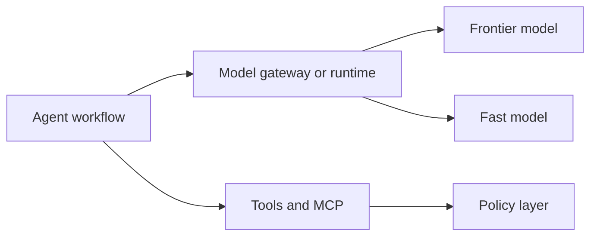

# Model Runtime Strategy

Use state-of-the-art models, but do not build the architecture around one model.

## Principles

- Treat models as replaceable engines.
- Keep product logic in code, specs, tools, and state.
- Use stronger models for planning, synthesis, architecture, review, and hard debugging.
- Use cheaper or faster models for narrow mechanical tasks when quality risk is low.
- Record model-sensitive assumptions in docs or configuration.

## Runtime Boundary

The factory should improve even when the model changes.

