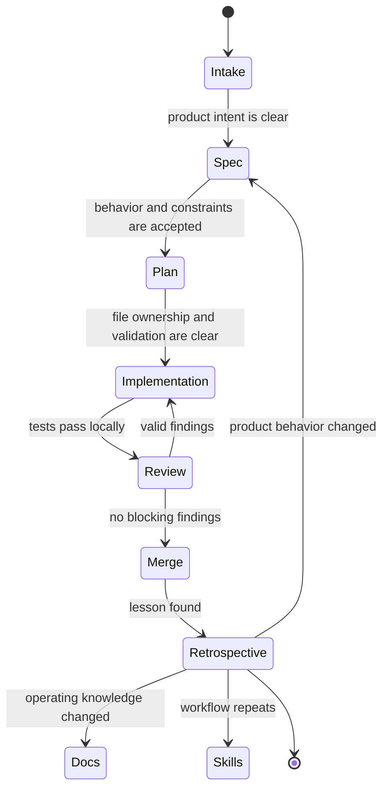

# Software Factory Operating Model

The software factory is a set of repeatable loops, not a single tool. Humans own intent and judgment. Agents accelerate research, planning, implementation, review, and documentation.

## Roles

| Role | Owns | Must Produce |
| --- | --- | --- |
| Product owner | user problem, scope, acceptance criteria | `specs/` update |
| Planning agent | repo research, technical approach, risks | `plans/PLAN_<NAME>.md` |
| Implementation agent | scoped code changes and tests | diff plus validation evidence |
| Review agent | independent review against repo contracts | review findings or residual risk |
| Maintainer | merge decision and durable standards | docs, skills, rules, or tests |

## Factory Lifecycle

## Operating Rules

- A spec describes what should be true for users.
- A plan describes how the repo will change.
- Code implements only the approved scope.
- Review checks the diff against specs, plans, docs, tests, and permissions.
- Durable lessons become tests, docs, examples, rules, or skills.

## Minimum Bar For Meaningful Work

- A linked spec or explicit statement that no spec is needed.
- A plan with implementation details before code.
- Tests or a clear reason tests are not practical.
- A review pass for correctness, permissions, architecture, and docs drift.
- A final validation record that names commands run and gaps left open.
