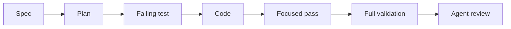

# TDD And Validation

The factory uses tests as executable memory. Review findings and production bugs should become regression tests whenever practical.

## Test-First Loop

1. Read the spec and plan.
2. Write the smallest failing test for the next behavior.
3. Implement the smallest code change that passes.
4. Refactor only after the test passes.
5. Run the focused test, then the full required validation.

## Validation Layers

| Layer | Purpose | Example |
| --- | --- | --- |
| Unit tests | prove small deterministic behavior | `make test` |
| Static checks | catch syntax and style drift | `make lint` |
| Factory checks | prove required artifacts exist | `make validate-factory` |
| Review checks | catch design, security, and architecture gaps | `.agents/skills/agentic-code-review/SKILL.md` |
| Tool policy checks | protect MCP and external integrations | `.agents/skills/mcp-tool-policy-review/SKILL.md` |

## When Test-First Is Not Practical

Test-first may be hard for exploratory UI work, provider integrations, or one-off docs. In those cases:

- add the strongest regression coverage available
- document manual validation evidence
- add a checklist item if automation is not yet worth it
- create a follow-up only when the gap materially affects safety or maintainability

## Mermaid

