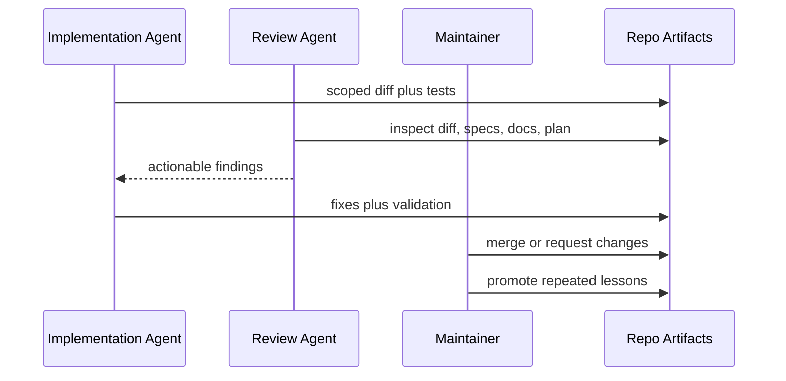

# PLAN_AGENTIC_REVIEW_LOOP

## Goal

Make agentic code review a repeatable, self-enforcing loop in the starter repository.

## Repo Research

- Files inspected: `AGENTS.md`, `.github/pull_request_template.md`, `.agents/skills/agentic-code-review/SKILL.md`, `docs/AI_CODE_REVIEW_LOOP.md`.
- Specs consulted: `specs/use-cases/use-case-002-agentic-review-loop.md`.
- Existing patterns: concise skills, checklist-driven PR templates, validation through `make validate-factory`.

## Implementation Details

- Keep the review workflow in `.agents/skills/agentic-code-review/SKILL.md`.
- Keep human-facing expectations in `docs/AI_CODE_REVIEW_LOOP.md`.
- Keep PR submitter prompts in `.github/pull_request_template.md`.
- Add durable validation by listing required review-loop files in `scripts/validate_factory.py`.
- Use `docs/examples/EXAMPLE_REVIEW_REPORT.md` as the sample output format.

## Tests

- Unit: no domain code required.
- Integration: `make validate-factory` confirms required artifacts exist.
- CI: GitHub Actions runs lint, tests, and factory validation.

## Rollout

- Migration: none.
- Backout: remove the required validation entries and sample artifacts.
- Docs: update `README.md` useful links and sample scenarios.

## Mermaid

