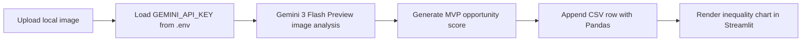

# Plan: Bayanihan Vision Streamlit MVP

## Goal

Build `apps/web/app.py` for the Bayanihan-Vision "Lumos Barangay" hackathon MVP. The app lets a user upload a local community photo, sends it to a Gemini 3 series model through the `google.generativeai` Python SDK, shows a structured opportunity report, logs a mock opportunity score with Pandas, and visualizes the ledger for inequality evidence.

## Files To Change

- `apps/web/app.py`: New Streamlit app containing UI, Vision API integration, CSV ledger helpers, and chart rendering.

## Key Assumptions

- The repository root is two levels above `apps/web/app.py`.
- API keys live in environment variables or a local untracked `.env` file.
- The app should use `python-dotenv` to load `GEMINI_API_KEY`.
- The app should prefer `gemini-3-flash-preview` because official Gemini docs list it as the Gemini 3 Flash model ID.
- `gemini-3.1-flash-lite` is included only as a fallback candidate because it was requested, but it was not found in the official Gemini model listing during implementation.
- The app should call `genai.list_models()` when the preferred model fails so users can debug model availability.
- `data/inequality_ledger.csv` may not exist before the first successful report, so the app creates it on demand.

## Implementation Details

1. Streamlit UI
   - Configure the page title and wide layout.
   - Add the title `Lumos Barangay: Opportunity Scanner`.
   - Add a JPG/JPEG/PNG uploader, PIL image preview, and report button.
   - Show friendly errors for missing uploads, missing API keys, and API failures.

2. Vision API Integration
   - Load `.env` values with `python-dotenv`.
   - Configure `google.generativeai` with `GEMINI_API_KEY`.
   - Send the uploaded PIL image to `genai.GenerativeModel("gemini-3-flash-preview")`.
   - If the preferred model fails, list available `generateContent` models and try the fallback candidate.
   - Use the exact hackathon prompt provided by the user.

3. Data Science Ledger
   - Generate a random MVP opportunity score from 40 to 95.
   - Append `Timestamp`, `Barangay_Name`, and `Opportunity_Score` to `data/inequality_ledger.csv`.
   - Read the CSV with Pandas and display summary metrics plus a bar chart of historical scans.

## Flow

## Validation Strategy

- Compile `apps/web/app.py` to catch syntax errors.
- Run the repository's required checks where practical:
  - `make lint`
  - `make test`
  - `make validate-factory`

## Validation Result

- Local execution is still blocked because `python`, `python3`, `py`, `pip`, `streamlit`, and `make` are not available on PATH in the current Windows sandbox.
- Attempted checks: `python -m py_compile apps/web/app.py`, `python -m unittest discover -s apps/service/tests -p test_*.py`, `python scripts/validate_factory.py`, and `make lint`.
- A static readability pass was completed, including checking that `apps/web/app.py` has no lines over 100 characters.
- The latest model update was source-checked against official Gemini docs: `gemini-3-flash-preview` is listed as the Gemini 3 Flash model ID and supports image inputs; `gemini-3.1-flash-lite` was not found in the official model list.

## Rollout Notes

- Students can run locally with:
  - `pip install streamlit pandas`
  - `streamlit run apps/web/app.py`
- Add either `GEMINI_API_KEY=...` or `OPENAI_API_KEY=...` to `.env`.
