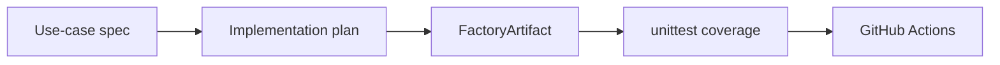

# PLAN_EXAMPLE_FEATURE

## Goal

Add a tiny domain artifact model to demonstrate the software factory loop.

## Implementation Details

- Add `apps/service/software_factory_sample/factory.py`.
- Define `ArtifactKind` enum for `spec`, `plan`, `doc`, `skill`, and `test`.
- Define immutable `FactoryArtifact` dataclass with `kind`, `title`, and `owner`.
- Add `create_artifact()` validation helper.
- Add unit tests under `apps/service/tests/`.

## Validation

```bash
make lint
make test
```

## Mermaid



