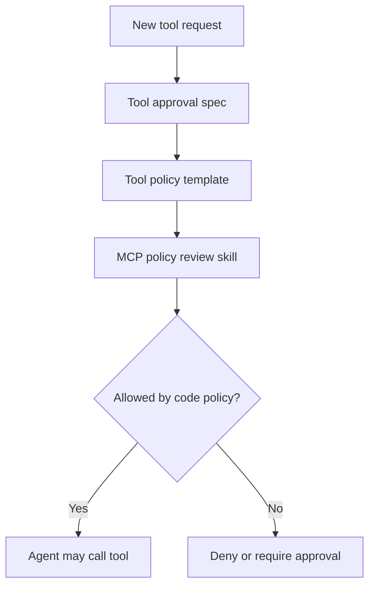

# PLAN_MCP_TOOL_APPROVAL

## Goal

Provide a copyable planning pattern for adding MCP tools without relying on prompt-only safety.

## Repo Research

- Files inspected: `docs/MCP_TRUST_BOUNDARY.md`, `mcp/example-readonly-server.js`.
- Specs consulted: `specs/use-cases/use-case-003-mcp-tool-approval.md`.
- Existing patterns: placeholder configs use dummy values and avoid real secrets.

## Implementation Details

- Add `.agents/skills/mcp-tool-policy-review/SKILL.md` for tool-surface review.
- Keep policy fields in `docs/MCP_TRUST_BOUNDARY.md`: tool name, owner, scopes, approvals, logging, tests.
- Keep example MCP config read-only by default.
- Document trust-boundary decisions in `docs/MCP_TRUST_BOUNDARY.md`.
- Add validation entries so required MCP governance files stay present.

## Tests

- Unit: no production MCP server is built in the starter.
- Integration: `make validate-factory` verifies required policy artifacts.
- Manual: inspect example config to confirm it contains no secrets.

## Rollout

- Migration: none.
- Backout: remove the sample use case, plan, skill, and validation entries.
- Docs: keep `docs/MCP_TRUST_BOUNDARY.md` as the durable current-state reference.

## Mermaid

