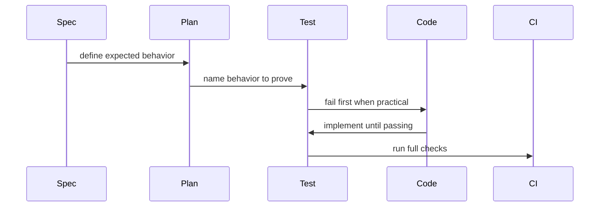

# PLAN_TDD_IMPLEMENTATION_LOOP

## Goal

Show how implementation agents should move from plan to code with tests acting as executable guardrails.

## Repo Research

- Files inspected: `apps/service/software_factory_sample/factory.py`, `apps/service/tests/test_factory.py`, `Makefile`.
- Docs consulted: `docs/TDD_AND_VALIDATION.md`.
- Existing patterns: standard-library Python, `unittest`, and simple Make targets.

## Implementation Details

- Keep the implementation workflow in `.agents/skills/tdd-implementation-loop/SKILL.md`.
- Keep validation expectations in `docs/TDD_AND_VALIDATION.md`.
- Keep command examples in `Makefile` so agents can run them without extra setup.
- Use the PR checklist and `docs/TDD_AND_VALIDATION.md` when a change has more than one meaningful risk.

## Tests

- Unit: `make test`.
- Lint: `make lint`.
- Factory artifact validation: `make validate-factory`.

## Rollout

- Migration: none.
- Backout: remove the sample doc, plan, skill, and validation entries.
- Docs: link the TDD document from `README.md`.

## Mermaid

